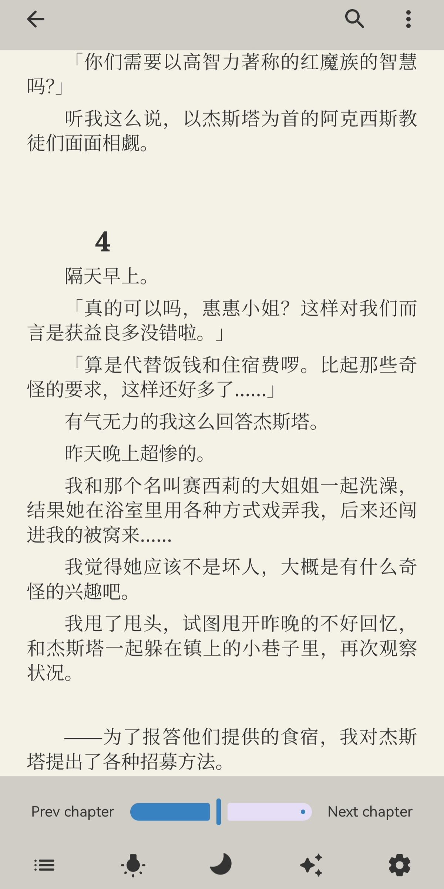
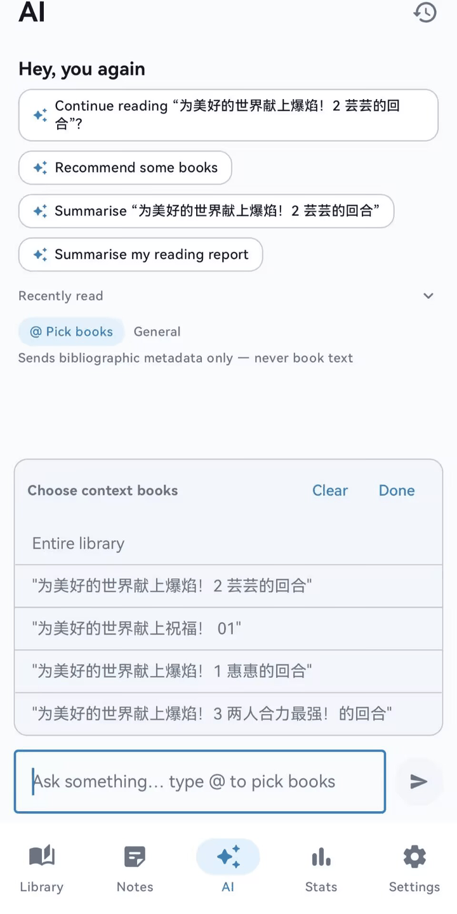
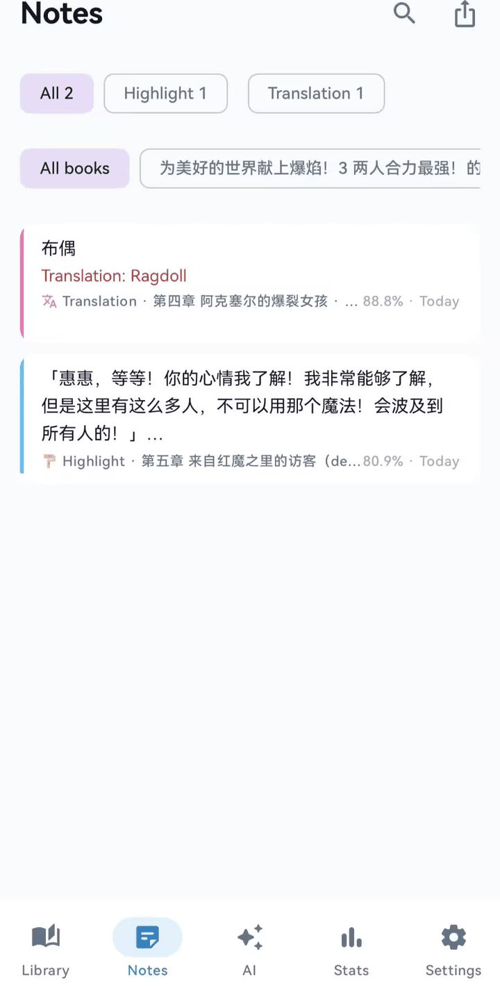

# Narvive

> **Narrative + Alive** —— 一款基于 **Jetpack Compose** 的 Android 阅读器，深度集成 **BYOK（Bring Your Own Key）AI** 能力。
> 支持 EPUB / TXT / PDF 三种格式，围绕阅读提供标注、翻译、改写、续写、角色对话、人物关系图、时间轴演进图等 AI 辅助功能，并内置书架管理、阅读统计、云备份（WebDAV）与可下载字体。

[English](README.md) | **简体中文** | [繁體中文](README.zh-TW.md)

[](https://developer.android.com)
[](https://kotlinlang.org)
[](https://developer.android.com/jetpack/compose)
[](LICENSE)
[](https://github.com/k1anyang/Narvive/actions/workflows/build.yml)

| 书架 | 阅读器 | 选区操作 | AI 对话（跨书） | 笔记中心 |
| --- | --- | --- | --- | --- |
|  |  |  |  |  |

---

## 目录

- [项目简介](#项目简介)
- [核心功能特性](#核心功能特性)
- [技术栈](#技术栈)
- [运行环境要求](#运行环境要求)
- [安装与部署](#安装与部署)
- [快速上手](#快速上手)
- [配置项说明](#配置项说明)
- [界面语言](#界面语言)
- [隐私](#隐私)
- [项目目录结构](#项目目录结构)
- [主要模块功能介绍](#主要模块功能介绍)
- [使用示例](#使用示例)
- [贡献指南](#贡献指南)
- [许可证](#许可证)

---

## 项目简介

Narvive 是一个单模块 Android 应用（`com.narvive.app`），目标是把「阅读」与「AI」深度结合：

- **多格式阅读**：EPUB 基于 [Readium Kotlin Toolkit](https://github.com/readium/kotlin-toolkit) 渲染，TXT 为自研章节切分 + Compose 渲染，PDF 为骨架实现（**early MVP**，Phase 5.5 真机联调）。
- **本地优先**：书籍、标注、书签、会话等全部存本地 Room 数据库，可离线使用；支持 ZIP 备份与 WebDAV 云同步。
- **BYOK AI**：不内置任何模型服务，用户自带 API Key（DeepSeek / OpenAI / Gemini 或任意 OpenAI 兼容 / Anthropic 协议服务），配置后即可启用全站的 AI 功能。
- **三语界面**：简体中文 / 繁體中文 / English，设置内即时切换，并配套简体与繁体两套中文字族。
- **隐私友好**：API Key 使用 `EncryptedSharedPreferences` 加密存储，且**绝不写入备份包**。

---

## 核心功能特性

### 书架与书籍管理

- 导入 **EPUB / PDF / TXT**，支持系统文件选择器（SAF）与「打开方式 / 分享」外部导入。
- 多选导入 + 导入预览：自动识别格式、文件大小，按 **SHA-256 去重**，重复文件给出明确提示。
- EPUB 元数据解析：书名、作者、简介、封面（封面解码后压缩为 WebP 节省空间）。
- 网格 / 列表两种视图，可调列数；排序（书名 / 作者 / 最近阅读 / 导入时间 / 进度）与搜索。
- **合集（分组）**：创建 / 重命名 / 删除合集、批量加入合集、内置「我喜欢」分组、未分组筛选。
- 批量删除（可选同时清理缓存）、最近在读入口。

### 阅读器

- 统一 `ReaderController` 抽象：EPUB / TXT / PDF 共享同一套 HUD、设置、标注与 AI 交互。
- EPUB：Readium 分页 / 上下滚动模式、目录、CFI 定位、进度条按「字符位置」锚定（排版/间距变化不漂移）。
- TXT：自动编码识别（UTF-8 / GBK / GB18030）、正则切章、滚动 / 分页渲染、字符级精准进度。
- 阅读主题（纸张 / 羊皮纸 / 护眼绿 / 深色 / 黑色 / 自定义）、日/夜间模式、护眼模式、亮度（可跟随系统）。
- 排版：字号、行距、边距、对齐、段距、首行缩进；EPUB 可选择「尊重出版方排版」或阅读器全权接管。
- 翻页动画（左右 / 上下 / 无）、自动翻页（扫描线，速度可调）、音量键翻页、屏幕常亮、休息提醒。
- 中英文双字体独立设置，字体可在线下载（见「字体」）。
- 目录抽屉、进度条拖动跳转、上一章 / 下一章、位置回退、书内全文搜索（结果可跳转 + 闪烁定位）。
- 书签：位置实时匹配（同页/同块），带章节名与预览文本。

### 标注、翻译与笔记

- 选区操作：**高亮**（多色）、**笔记**（自动附带黄色高亮）、**翻译**（结果缓存，红下划线内嵌显示）、**问 AI**、**改写 / 续写**、**角色对话**。
- 翻译缓存：同一「书 + 原文 + 目标语言」只调用一次 AI。
- 笔记中心：聚合高亮 / 笔记 / 翻译 / AI 保存 / 角色对话 / 改写六类标注，支持按类型、按书筛选、搜索、删除，导出单条或全部为 Markdown。

### AI 能力（BYOK）

- **底部 AI 全局对话**（不绑定书籍）：
  - 跨书 `@` 选书（最多 5 本）或「全部书库」聚合上下文（仅元数据、无正文）。
  - 个性化问候 + 随机建议卡片（可按 AI 偏好风格渲染）。
  - 意图路由：统计 / 推荐 / 指定书名（`《》` 或全名）/ 进度 / 模糊书名，命中后注入本地阅读数据。英文界面下意图路由为**中英并集**匹配，英文提问同样命中。
  - 会话重命名 / 置顶 / 删除，首轮完成后自动生成 ≤12 字标题。
- **书籍内「问 AI」**：上下文三档可切换（**选区 / 本章 / 全书**），本章超长自动分块（≤5 万字全量，超长分 8000 字块，AI 选最相关 2 块）。
- **快捷指令**：解释 / 翻译 / 总结本章 / 词汇 / 人物关系图 / 时间轴演进图（图表为结构化 JSON + Canvas 绘制，支持缩放、拖拽、节点高亮）。
- **角色扮演**：角色卡 AI 抽取（身份 / 性格 / 语气 / 知识边界），一本书多会话，对话片段可保存为笔记，不剧透已读进度。
- **改写 / 续写**：独立页面，自动取章节上下文（续写取上文 1200 字，改写取前后各 600 字），结果落库可导出。
- **Provider 降级链（FallbackChain）**：按优先级逐个尝试，连续失败 3 次自动降级，支持手动恢复。
- **提示词可配置**：12 套提示词模板（系统提示 / 角色扮演 / 改写 / 续写 / 翻译 / 角色卡 / 快捷指令 / 关系图 / 时间轴）均可在设置中编辑与重置。**AI 输出语言跟随界面语言**：系统提示词、12 套默认模板、问候语与建议卡、意图路由均按当前界面语言取值；用户自行修改过的提示词不会被语言切换覆盖。
- **AI 偏好**：自动归纳最近对话生成偏好档案（简洁 / 正式 / 友好、是否用表情、常用术语），或手动填写。

### 界面语言

- 支持 **简体中文（默认）/ 繁體中文 / English**，在**设置 → 语言**中切换（独立页面，每个语言一行，当前语言带勾选标记），即时生效；切换后**停留在当前页面**，导航状态自动恢复。
- 基于 AndroidX 官方 per-app language（`AppCompatDelegate.setApplicationLocales`），语言偏好由 AppCompat 持久化；Android 13+ 会同步到系统的「设置 → 应用 → Narvive → 语言」。
- 中文字形按语言分派**两套 HarmonyOS Sans 字族**（SC / TC），繁体界面使用繁体字形。
- 机制细节、资源组织方式与**新增一门语言的步骤**见 [docs/i18n.md](docs/i18n.md)。

### 统计

- 今日 / 本周 / 连续阅读天数 / 累计读完；日 / 周 / 月三种柱状图（可前后翻看，回溯 6 个月）；已读完书籍列表。

### 设置与数据

- **AI 设置**：管理 Provider（预设 + 自定义）、测试连接、按协议拉取模型列表、优先级调整、降级恢复。
- **字体**：从 Gitee 目录在线下载字体（断点续传、大小校验），中英字体独立应用（EPUB 走 CSS 字体栈，TXT 走 Compose Typeface）。
- **备份**：导出 / 恢复 ZIP（含书籍文件、封面、标注、书签、合集与部分设置；**不含 API Key**），按 hash 去重合并。
- **WebDAV**：云备份上传 / 列表 / 恢复，自动同步（退后台时），密码加密存储，仅保留最近 5 个备份。
- **存储**：书籍 / 封面 / 字体 / 缓存四类占用统计与缓存清理。
- **语言**：设置主页「外观」组内的独立入口，进入后选择 简体中文 / 繁體中文 / English。
- **问题反馈**：设置主页「关于与隐私」组末的独立入口，提供邮箱反馈、GitHub Issue、GitHub Discussions 三个渠道，并可一键复制诊断信息（应用版本 / 界面语言 / 设备型号 / Android 版本 / ABI；**不含书籍内容与 API Key**）。「关于 Narvive」页的开发者卡片同时给出邮箱与 GitHub 主页（`github.com/k1anyang`）链接。

---

## 技术栈

| 分类 | 技术 | 版本 |
| --- | --- | --- |
| 语言 | Kotlin | 2.3.20 |
| UI | Jetpack Compose（Material 3） | BOM 2026.03.01 |
| 构建 | Android Gradle Plugin / Gradle | AGP 9.3.0 / Gradle 9.5.0 |
| 架构组件 | Navigation Compose / Lifecycle / ViewModel | 2.9.0 / 2.8.7 |
| 依赖注入 | Hilt + KSP | 2.60.1 / 2.3.6 |
| 本地数据库 | Room | 2.8.4 |
| 偏好存储 | DataStore Preferences | 1.1.3 |
| 安全存储 | Security Crypto（EncryptedSharedPreferences） | 1.1.0 |
| 序列化 | kotlinx.serialization | 1.9.0 |
| 网络 | OkHttp + okhttp-sse | 4.12.0 |
| 图片 | Coil | 2.7.0 |
| 阅读引擎 | Readium Kotlin Toolkit（shared/streamer/navigator） | 3.3.0 |
| EPUB 解析 | Jsoup | 1.18.1 |
| 兼容 | coreLibraryDesugaring | 2.1.5 |
| 多语言 | AppCompat（per-app language） | 1.7.1 |

**架构模式**：MVVM + Repository + 单模块，采用 Hilt 依赖注入、Kotlin Flow / StateFlow 响应式状态管理、Room Flow 数据观察、kotlinx.serialization 做 JSON 编解码。

**分层结构**：

```
UI (Compose Screen + ViewModel)
        │ 依赖
Domain (Model + Repository 接口)
        ▲
Data (Room DAO/Entity + Repository 实现 + DataStore + Keystore)  ←→  Service (AI / Reader / Font / Backup / WebDAV / Storage)
```

---

## 运行环境要求

### 硬件 / 系统

- Android **8.0（API 26）** 及以上设备。
- 建议真机联调阅读器与 AI 功能（模拟器亦可，但 EPUB 字体注入、WebView 等效果以真机为准）。

### 开发环境

| 工具 | 要求 |
| --- | --- |
| JDK | **21**（运行 Gradle 所必需） |
| Android SDK | `compileSdk 36`，`targetSdk 35`，`minSdk 26` |
| Gradle | 9.5.0（使用项目自带 wrapper，无需手动安装） |
| Android Studio | 建议最新稳定版（支持 AGP 9.3.0 / Kotlin 2.3.20） |
| 网络 | 首次构建需访问 Maven 仓库（已配置阿里云镜像加速） |

> **JDK 版本容易混淆**：`gradle/gradle-daemon-jvm.properties` 固定了 `toolchainVersion=21`，因此**运行 Gradle 需要 JDK 21**；而 `app/build.gradle.kts` 里的 `JavaVersion.VERSION_17` 指的是**字节码目标版本**，两者不是同一件事。用 JDK 17 启动 Gradle 会直接失败。

> 项目在 `gradle.properties` 中配置了 JDK 路径，若你的机器路径不同，请修改：
> ```properties
> org.gradle.java.installations.paths=D\:/Android/Android Studio/jbr,H\:/java eclipse/jdk-22.0.2
> ```

> Debug APK 体积约 **59 MB**，因为打包了简体（SC）与繁体（TC）两套完整中文字族，合计约 36 MB。

---

## 安装与部署

### 1. 获取代码

```bash
git clone https://github.com/k1anyang/Narvive.git Narvive
cd Narvive
```

### 2. 配置本地环境

确认 `local.properties` 指向你的 Android SDK（若不存在，Android Studio 打开项目时会自动生成）：

```properties
sdk.dir=C\:\\Users\\<you>\\AppData\\Local\\Android\\Sdk
```

### 3. 编译与安装 Debug 包

使用命令行（Windows；macOS / Linux 把 `.\gradlew.bat` 换成 `./gradlew`）：

```powershell
# 编译 Kotlin（快速校验）
.\gradlew.bat :app:compileDebugKotlin

# 构建 Debug APK
.\gradlew.bat :app:assembleDebug

# 安装到已连接设备
.\gradlew.bat :app:installDebug
```

或直接用 Android Studio 打开项目，点击 **Run ▶** 选择目标设备运行。

### 4. 构建 Release 包

```powershell
.\gradlew.bat :app:assembleRelease
```

> **项目未配置 release 签名**（`app/build.gradle.kts` 中没有 `signingConfig`），因此 `assembleRelease` 产出的是**未签名** APK（`app/build/outputs/apk/release/app-release-unsigned.apk`），无法直接安装，分发前需自行签名。

> Release 构建开启了代码混淆（`isMinifyEnabled = true`），规则见 `app/proguard-rules.pro`。

产物路径：

- Debug：`app/build/outputs/apk/debug/app-debug.apk`
- Release：`app/build/outputs/apk/release/app-release-unsigned.apk`（未签名）

推送版本 tag 时，CI 会向 GitHub Release 附带**两个** APK：R8 优化后的未签名 release 包，以及可直接安装体验的 debug 签名包。

---

## 快速上手

1. **导入书籍**：打开 App → 书架页 → 右上角导入 → 选择 EPUB / TXT / PDF 文件（或从系统「打开方式 / 分享」直接发送到 Narvive）。
2. **开始阅读**：点击书籍进入阅读器，点屏幕中央呼出 HUD，可调目录 / 字号（Aa）/ 亮度 / 主题。
3. **配置 AI**：设置 → AI 设置 → 选择预设 Provider（DeepSeek / OpenAI / Gemini）或添加自定义 Provider → 填入 API Key → 「测试连接」→ 「获取模型列表」选择模型。
4. **使用 AI**：
   - 阅读器内长按选中文字 → 问 AI / 翻译 / 高亮 / 笔记 / 改写 / 续写 / 角色对话。
   - 底部 AI tab 直接对话，输入 `@` 引用多本书或勾选「全部书库」。
5. **查看笔记 / 统计**：底部「笔记」「统计」tab 查看聚合标注与阅读数据。
6. **备份**：设置 → 备份，导出 / 恢复；设置 → 服务 → WebDAV 配置云同步。
7. **切换语言**：设置 → 语言，选择 简体中文 / 繁體中文 / English。

---

## 配置项说明

所有偏好通过 `NarviveDataStore`（DataStore Preferences）持久化；API Key 与 WebDAV 密码通过 `ApiKeyStore` / `WebDavStore`（EncryptedSharedPreferences）加密存储。

### AI Provider 配置

存储于 `ai_providers_json`（不含 Key），预设 Provider：

| id | 名称 | Base URL | 默认模型 | 协议 |
| --- | --- | --- | --- | --- |
| `deepseek` | DeepSeek | `https://api.deepseek.com` | `deepseek-chat` | OpenAI Chat |
| `openai` | OpenAI | `https://api.openai.com` | `gpt-4o-mini` | OpenAI Chat |
| `gemini` | Gemini | `https://generativelanguage.googleapis.com/v1beta/openai` | `gemini-2.0-flash` | OpenAI Chat |

支持协议（`AiProtocol`）：

- `OPENAI_CHAT` —— OpenAI Chat Completions
- `OPENAI_RESPONSES` —— OpenAI Responses API
- `ANTHROPIC` —— Anthropic Messages

> 预设 Provider 仅允许修改模型、开关与优先级（名称 / URL / 协议锁定）；自定义 Provider 全字段可改。

### 提示词模板（PROMPT 设置）

12 套可编辑模板，占位符由 `PromptRenderer` 替换：

| id | 说明 | 主要占位符 |
| --- | --- | --- |
| `chat` | 阅读助手系统提示 | `{{bookTitle}}` `{{author}}` |
| `roleplay` | 角色扮演系统提示 | `{{characterName}}` `{{identity}}` `{{personality}}` `{{tone}}` `{{knowledgeBoundary}}` |
| `rewrite` | 改写提示词 | `{{originalText}}` `{{context}}` `{{instruction}}` |
| `continue` | 续写提示词（仅取上文） | 同上 |
| `translate` | 翻译提示词 | `{{text}}` `{{contextBlock}}` |
| `character_card` | 角色卡生成 | `{{characterName}}` `{{chapterLabel}}` `{{excerptBlock}}` |
| `quick_explain` / `quick_translate` / `quick_summarize` / `quick_vocab` | 快捷指令文案 | 无 |
| `relationship_graph` | 人物关系图 | `{{scope}}` `{{chapterTitle}}` `{{chapterText}}` |
| `timeline` | 时间轴演进图 | 同上 |

### AI 偏好

- `ai_pref_enabled`：是否启用偏好客制化。
- `ai_pref_mode`：`auto`（自动归纳）/ `manual`（手动填写）。
- `ai_pref_profile_json`：偏好档案（summary / style / useEmoji / terms）。

### 阅读设置（关键项）

| 键 | 含义 | 默认值 |
| --- | --- | --- |
| `reading_theme` | 阅读主题 | `paper` |
| `font_size` / `line_height` | 字号 / 行距（书籍级覆盖） | 17 / 1.4 |
| `font_family_cjk` / `font_family_latin` | 中 / 英字体 id | `system` |
| `alignment` | 对齐 | `justify` |
| `publisher_styles` | EPUB 是否尊重出版方排版 | `true` |
| `page_flip_animation` | 翻页动画 | `slide` |
| `eye_protection` | 护眼模式 | `false` |
| `progress_display_mode` | 进度显示 | `percentage` |
| `dark_theme` | 外观主题 | `system` |
| `library_view` / `library_sort` | 书架视图 / 排序 | `grid` / `LAST_READ` |

完整键定义见 `NarviveDataStore.kt` 的 `companion object`。

> **界面语言不在 DataStore 中**：它由 AndroidX AppCompat 自行持久化（Android 13+ 走系统 `LocaleManager`，更低版本走 AppCompat 的 `SharedPreferences`），以避免双源冲突。

---

## 界面语言

Narvive 提供三语界面：**简体中文（默认）/ 繁體中文 / English**。

- **切换位置**：设置 → 语言（独立页面，每个语言一行，当前语言带勾选标记）。
- **即时生效**：切换后 AppCompat 重创建 Activity，界面文案立即更新；`NavController` 状态由 `rememberSaveable` 恢复，因此**停留在当前页面**，不会跳回书架。
- **切换闪烁与方案取舍**：本项目**刻意依赖官方的 Activity 重建行为**。切换语言会销毁并重建 Activity，因此 ViewModel 一并重建，所有文案（含缓存在状态里的）天然正确，**不需要任何手工刷新钩子**，维护成本最低。
  - **已接受的代价**：每次切换会**闪一帧**——浅色主题闪黑、深色主题闪白。这是系统在窗口销毁与重绘之间绘制的空窗口，**无法靠应用代码遮盖**：对齐 `windowBackground`、`values-night` 变体与运行时改写背景只能改善**冷启动**首帧；而叠一层淡入会让它更明显。
  - 因为正确性依赖重建，**所有用户可见文案必须走资源**。详见 [docs/i18n.md](docs/i18n.md) §2.1（其中记录了「拦截重建」方案被实现后又回退的完整理由，勿重复踩坑）。
- **系统同步**：`res/xml/locales_config.xml` 经 `AndroidManifest.xml` 的 `android:localeConfig` 引用，Android 13+ 的「系统设置 → 应用 → Narvive → 语言」也能看到这三个选项并与应用内选择保持一致。
- **AI 输出语言跟随界面**：系统提示词、12 套默认提示词模板、问候语与建议卡、意图路由正则（中英并集）均按当前界面语言取值。**用户自行修改过的提示词属于用户数据，语言切换绝不覆盖**。
- **中文字形分派**：界面字族为 HarmonyOS Sans，按语言选择 SC / TC 两套字族（`ui/theme/Type.kt` 的 `narviveTypography(traditionalChinese)`，在 `NarviveTheme` 中经 `MaterialTheme.typography` 下发，消费方零改动）。两套字符合计约 36 MB。

> 阅读正文（EPUB / TXT / PDF）**不走**界面字族，沿用 `service/font` 的独立字体系统，由用户在字体设置中自选，两者互不影响。

**开发细节**（资源目录组织、键命名约定、`stringResource` 作用域铁律、`UiMessage`、以及新增一门语言的完整步骤）见 [docs/i18n.md](docs/i18n.md)。

---

## 项目目录结构

```
Narvive
├── gradle/                         # libs.versions.toml（版本目录）+ wrapper（9.5.0）
├── app/
│   ├── build.gradle.kts            # 应用模块构建脚本
│   ├── proguard-rules.pro          # 混淆规则
│   └── src/main/
│       ├── AndroidManifest.xml     # 清单（权限/入口/FileProvider/屏幕方向/localeConfig）
│       ├── res/
│       │   ├── values/             # 资源：默认语言（简体中文）
│       │   ├── values-en/          # 资源：English
│       │   ├── values-b+zh+Hant/   # 资源：繁體中文
│       │   ├── font/               # HarmonyOS Sans SC + TC（各 Regular/Medium/Bold）
│       │   ├── raw/                # 字体授权文本、字体服务密钥库
│       │   └── xml/                # locales_config / file_paths / network_security_config
│       └── java/com/narvive/app/
│           ├── MainActivity.kt     # 单 Activity 入口 + 外部导入 + WebDAV 自动同步
│           ├── NarviveApp.kt       # Application（Hilt + 崩溃处理 + WebView 调试）
│           ├── CrashHandler.kt     # 全局崩溃处理
│           ├── di/                 # Hilt 模块（Database / Repository 绑定）
│           ├── data/               # datastore / keystore / local(Room DAO,Entity,迁移) / repository
│           ├── domain/             # model（领域模型）+ repository（接口）
│           ├── service/            # ai / reader / font / 导入 / 备份 / WebDAV / 存储 / 缓存
│           └── ui/
│               ├── prefs/          # AppLanguage（界面语言枚举与切换）
│               ├── message/        # UiMessage（跨层可翻译消息）
│               ├── navigation/     # 路由与底部导航
│               ├── theme/          # 主题（Color/Theme/Type/Shape/Spacing/Motion）
│               ├── components/     # 通用组件（流式光标/滑动删除/加载动画等）
│               └── screen/         # 各页面（library/reader/chat/notes/stats/settings/...）
└── docs/                           # 文档（DESIGN.md 视觉规范 / i18n.md 多语言说明）
```

---

## 主要模块功能介绍

### `ui/screen/library` — 书架

`LibraryViewModel` 组合书籍 / 合集 / 成员关系 / 过滤偏好四路 Flow，派生出排序、搜索、筛选后的列表；`LibraryScreen` 提供网格/列表切换、合集管理、多选批量操作与导入确认弹窗。

### `service/reader` — 阅读引擎

- `ReaderController`：统一接口（进度 / 章节 / Locator / 翻页 / 搜索 / 设置 / 章文本）。
- `EpubReaderController`：封装 Readium，处理目录提取、字符加权进度、高亮 / 翻译装饰（CFI 锚定）、自研书内搜索。
- `TxtReaderController`：编码识别 + 正则切章 + 字符偏移进度 + 扁平分块滚动渲染。
- `PdfReaderController`：基于 `androidx.pdf` 的骨架实现（MVP）。
- `ChapterTextExtractor` / `TocLoader`：阅读器外取章文本 / 目录（供改写、续写、AI、详情页使用）。

### `ui/screen/reader` — 阅读页

`ReaderViewModel` 是阅读器核心状态中枢：加载书籍、合成设置、采集 controller 状态、恢复进度、管理选区 / 高亮 / 笔记 / 翻译 / 书签 / 搜索 / 自动翻页 / 字体注入。配套 `ReaderScreen` 与 `components/` 下大量面板（Aa 面板、亮度、目录、搜索、选区气泡、翻译卡、高亮菜单、自定义主题等）。

### `service/ai` — AI 基础设施

- `AiService`：统一封装三种协议的非流式与 SSE 流式请求，错误翻译为可读提示（Key 错误 / 地址错误 / 参数错误）。
- `FallbackChain`：Provider 优先级 + 降级链，失败自动切换，连续失败 3 次降级。
- `PromptTemplates` / `PromptRenderer` / `PromptService`：提示词定义、占位符渲染、读写（DataStore）。
- `AiText` / `PromptDefaultsI18n` / `PromptLocaleProvider`：按当前界面语言提供系统提示词、问候语与建议卡、意图路由正则，以及 12 套模板的多语言默认值。
- `GraphModels`：人物关系图 / 时间轴的结构化 JSON 解析。
- `AiProfileStore` / `AiProfile`：AI 偏好持久化与自动归纳。
- `CharacterCardExtractor` / `TranslationCache`：角色卡抽取、翻译缓存查询。

### `ui/screen/chat` — AI 对话

- `GlobalChatViewModel` + `GlobalChatScreen`：底部全局 AI（跨书上下文、意图路由、会话管理、自动标题、偏好归纳）。
- `ChatViewModel` + `ChatScreen` / `ChatContent`：书籍内 AI（范围切换、快捷指令、图表生成）。
- `GraphSheet`：人物关系图 / 时间轴 Canvas 绘制（缩放、拖拽、高亮、固定图例）。
- `RoleplayViewModel` + 相关屏幕：角色扮演会话与角色卡。
- `CharacterCardScreen`：角色卡生成 / 编辑。

### `ui/screen/rewrite` — 改写 / 续写

`RewriteViewModel` 通过 `ChapterTextExtractor` 取章节上下文，按模式组装上下文窗口（续写上文 1200 / 改写前后各 600），结果落库为 `REWRITE` 标注，支持另存笔记与导出 TXT。

### `ui/screen/notes` / `stats` — 笔记 / 统计

- `NotesViewModel`：聚合标注、按类型 / 书筛选、搜索、删除、导出 Markdown。
- `StatsViewModel`：基于阅读会话计算今日/本周时长、连续天数、读完数，并绘制日/周/月柱状图。

### `ui/screen/settings` — 设置

- `AiSettingsViewModel` / `AiSettingsScreen`：Provider 管理、测试连接、拉取模型、优先级、降级恢复。
- `PromptSettingsScreen` / `AiPreferencesScreen`：提示词编辑、AI 偏好。
- `AppearanceScreen`：外观主题、外观模式、书架网格列数。
- `LanguageScreen`：界面语言选择（每个语言一行，当前语言带勾选标记）。
- `FeedbackScreen`：问题反馈（邮箱 / GitHub Issue / GitHub Discussions + 诊断信息复制）。
- `StorageScreen` / `WebDavScreen` / `BackupScreen` / `FontSettingsScreen` / `MoreSettingsScreen` 等。

### `service/font` — 字体

- `FontCatalogRepository`：从 Gitee `fonts.json` 拉取目录（离线回退本地缓存），过滤不可下载项。
- `FontDownloadManager`：OkHttp 流式下载 + 断点续传（Range）+ 大小校验。
- `FontResolver`：id → 文件 / CSS 注入 / Compose Typeface；EPUB 中英双字体走 CSS 字体栈，TXT 走单 Typeface。
- `FontFileServer` / `FontStorage` / `FontStatRepair`：本地 HTTP 服务与字体存储辅助。

### `service` 其余 — 数据与同步

- `BookImportService`：文件检测 / 去重 / 导入 / EPUB 元数据与封面抽取。
- `BackupService`：ZIP 备份 / 恢复（id 重映射、hash 去重、设置快照，API Key 不入包）。
- `WebDavService`：MKCOL / PUT / PROPFIND / GET / DELETE，自动同步与远端清理。
- `StorageService` / `AppCacheService`：存储统计与缓存清理。

---

## 隐私

- **本地优先**：无账号、无注册、无行为埋点、无分析 SDK。书库、笔记与阅读记录全部留在设备上。
- **BYOK**：AI 唯一的网络出口是你自己配置的服务商。请求由设备直连你填写的端点，不经过任何中间服务器。
- **密钥处理**：API Key 通过 `EncryptedSharedPreferences` 加密落盘，并被排除在备份包之外。
- 阅读、标注与统计功能可完全离线使用。

---

## 使用示例

### 示例 1：阅读器内 AI 翻译

1. 打开一本英文 EPUB，长按选中一段文字。
2. 在弹出的操作条点击「翻译」。
3. 首次调用走 AI 翻译并写入 `TRANSLATION` 标注（红下划线）；再次翻译同一句直接命中缓存，零额外调用。

### 示例 2：生成人物关系图

1. 进入某本书的「问 AI」（书籍详情页 → 问 AI，或阅读器内 AI 面板）。
2. 切换范围为「本章」或「全书」。
3. 点击快捷指令「人物关系图」，AI 输出结构化 JSON，`GraphSheet` 解析后绘制可缩放、拖拽、节点高亮的 Canvas 关系图。

### 示例 3：底部 AI 跨书对话

1. 底部切到「AI」tab。
2. 输入 `@` 弹出内联选书面板（**不收起键盘**），勾选最多 5 本书，或勾选「全部书库」。
3. 提问「帮我总结这几本书的共同主题」，AI 基于所选书籍的元数据（书名 / 作者 / 进度 / 简介）回答。

### 示例 4：改写 / 续写

1. 阅读器内长按选中文字 → 「改写」或「续写」。
2. 进入改写页，输入指令（如「改得更口语化」）。
3. 系统自动带上书名 / 作者 / 章节名 + 选区前后上下文（续写上文 1200 字，改写前后各 600 字），生成结果可另存笔记或导出 TXT。

### 示例 5：备份与恢复

1. 设置 → 备份 → 导出，生成 `NarviveBackup-YYYYMMDD.zip`（含书籍、封面、标注、书签、合集与部分设置）。
2. 换机或重装后：设置 → 备份 → 导入，按 hash 去重合并；同名不同 hash 的书保留两者并加「（导入）」后缀。

### 示例 6：切换界面语言

1. 设置 → 语言。
2. 选择「English」或「繁體中文」，界面文案立即更新，并停留在当前设置页。
3. 回到书架 / 阅读器 / AI 页，全站文案与 AI 输出语言均已切换；Android 13+ 可在系统「应用 → Narvive → 语言」看到同一选择。

---

## 贡献指南

欢迎参与 Narvive 的贡献！完整规范见 **[CONTRIBUTING.md](CONTRIBUTING.md)**，要点如下：

1. **Fork 仓库**，从 `main`（或默认分支）切出功能分支，命名如 `feature/xxx`、`fix/xxx`。
2. **代码风格**：遵循项目统一的 Kotlin 官方风格（`kotlin.code.style=official`），保持与现有代码一致的命名与分层。
3. **架构约定**：
   - 页面使用 `@HiltViewModel` + `StateFlow`（`MutableStateFlow` 私有、`StateFlow` 暴露）。
   - 数据访问通过 `domain/repository` 接口，实现放在 `data/repository`。
   - 跨页面数据持久化优先 DataStore / Room，敏感信息走 `keystore`。
4. **本地化**：所有用户可见文案必须走 `strings.xml`，禁止在 Kotlin 中硬编码中文；新增文案需**同时更新三个语言目录**（`values/`、`values-en/`、`values-b+zh+Hant/`）。详见 [docs/i18n.md](docs/i18n.md)。
5. **提交信息**：使用清晰的中文或英文提交说明，描述「做了什么、为什么」。
6. **测试**：改动核心逻辑（如 AI 解析、分块、进度计算、备份合并）请补充或更新单元测试（`app/src/test`）。
7. **提交 PR**：附上改动说明、影响范围与必要的验证截图 / 说明（阅读器与 AI 功能建议真机验证）。
8. **数据库变更**：新增字段请遵循既有 `MIGRATION_n_n+1` 模式递增版本号，并在 `NarviveDatabase` 中注册迁移。

提交前请确保：

```powershell
.\gradlew.bat :app:compileDebugKotlin   # 编译通过
.\gradlew.bat :app:assembleDebug        # 完整打包通过（可捕获资源合并与 i18n 问题）
```

---

## 许可证

Narvive 以 **Apache License 2.0** 发布，详见 [LICENSE](LICENSE)。

本项目依赖的第三方库遵循各自的开源许可证（AndroidX、Jetpack Compose、Hilt、Room、OkHttp、Coil、Readium Kotlin Toolkit、Jsoup 等）。应用内「设置 → 关于与隐私 → 开源许可」页面（`LicensesScreen`）用于展示第三方许可信息。

随应用打包的 **HarmonyOS Sans** 字体（简体 SC 与繁体 TC 两套）依据 HarmonyOS Sans Fonts License Agreement 使用，授权文本随包提供：`app/src/main/res/raw/harmonyos_sans_license.txt`。
